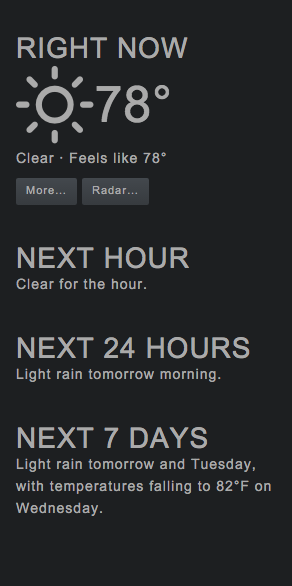

# weather-information package

Displays a nice summary of the weather in your editor.

## Credits

This package is heavily inspired by [Dark Sky](http://forecast.io), and uses it's API to pull weather information.
It also uses the awesome weather icons at [https://erikflowers.github.io/weather-icons/](https://erikflowers.github.io/weather-icons/).
